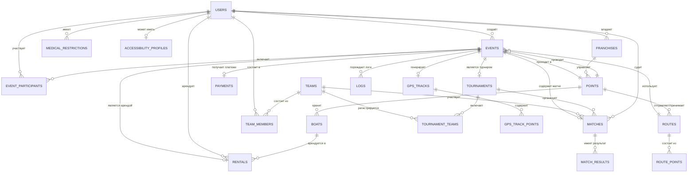

# ER-ДИАГРАММА ПЛАТФОРМЫ

## УРОВЕНЬ 1 — КОНЦЕПТУАЛЬНАЯ



## УРОВЕНЬ 2 — СХЕМА БАЗЫ ДАННЫХ

```
┌─────────────────────┐    ┌──────────────────────┐    ┌───────────────────┐
│       USERS         │    │       EVENTS         │    │      POINTS      │
├─────────────────────┤    ├──────────────────────┤    ├───────────────────┤
│ PK id: VARCHAR(7)   │◄───│ FK created_by        │───►│ PK id: VARCHAR(7) │
│    first_name       │    │ PK id: VARCHAR(7)    │    │    type           │
│    last_name        │───►│    event_type        │◄───│ FK franchise_id   │
│    role (ENUM)     │    │    start_time         │    │    lat, lng       │
│    phone            │    │    end_time           │    │    timezone       │
│    email            │    │ FK point_id          │    │    status         │
│    status           │    │ FK route_id          │    └───────────────────┘
│    medical_flags    │    │    status                   │
└─────────────────────┘    └───┬──────────────────┘     │
       │ │ │                   │ │ │ │                   │
       │ │ │    ┌──────────────┤ │ │ │                   │
       │ │ │    │  ┌───────────┼─┤ │ │                   │
       │ │ │    │  │  ┌────────┼─┼─┤ │                   │
       ▼ ▼ ▼    ▼  ▼  ▼       ▼ ▼ ▼ ▼                   │
┌────────────┐ ┌──────────┐ ┌──────────┐ ┌───────────┐  │
│EVENT_PART. │ │ RENTALS  │ │ GPS_TRK  │ │  TEAMS    │  │
│◄──────────►│ │          │ │          │ │           │  │
│ event_id   │ │ PK id    │ │ PK id    │ │ PK id     │  │
│ user_id    │ │ FK event │ │ FK event │ │ captain   │  │
│ role       │ │ FK boat  │ │ FK user  │ │ status    │  │
└────────────┘ │ FK user  │ │ status   │ └─────┬─────┘  │
               │ status   │ └─────┬────┘       │        │
               └──────────┘       │            │        │
                                  ▼            ▼        ▼
                           ┌────────────┐ ┌──────────┐ ┌───────────┐
                           │ GPS_POINTS │ │ TOURNAMT │ │MATCHES    │
                           │            │ │          │ │           │
                           │ track_id   │ │ PK id    │ │ PK id     │
                           │ lat, lng   │ │ FK event │ │ FK tournm │
                           │ timestamp  │ │ format   │ │ team_a/b  │
                           │ speed      │ │ status   │ │ score_a/b │
                           └────────────┘ └──────────┘ │ judge     │
                                                        └───────────┘
```

## ТАБЛИЦА: ВСЕ СУЩНОСТИ

| Сущность | Префикс | Описание | Модуль-владелец |
|----------|---------|----------|-----------------|
| users | U | Пользователи и роли | Core |
| events | E | Центральная сущность | Core |
| event_participants | - | Связь пользователей и событий | Core |
| points | P | Точки активности | Core |
| franchises | F | Франчайзинговые объединения | Franchise |
| routes | R | Маршруты | Geo |
| route_points | P | GPS-точки маршрутов | Geo |
| gps_tracks | G | Сессии GPS-трекинга | Geo |
| gps_track_points | - | Точки GPS-трекинга | Geo |
| activity_zones | Z | Зоны активности (безопасность) | Geo |
| boats | B | Лодки и оборудование | Rental |
| inventory_items | I | Инвентарь | Rental |
| rentals | A | Аренда | Rental |
| rental_inventory | - | Инвентарь в аренде | Rental |
| teams | T | Спортивные команды | Sport |
| team_members | - | Состав команд | Sport |
| tournaments | M | Турниры | Sport |
| tournament_teams | - | Участники турниров | Sport |
| matches | S | Матчи | Sport |
| match_results | R | Результаты матчей | Sport |
| payments | Y | Платежи | Finance |
| pricing | C | Тарифы | Finance |
| logs | L | Системные логи | Core |
| accessibility_profiles | L | Инклюзивные профили | Inclusive |
| medical_restrictions | M | Медицинские ограничения | Inclusive |
| adaptive_route_access | - | Доступность маршрутов | Inclusive |
| escort_assignments | K | Назначение сопровождения | Inclusive |
