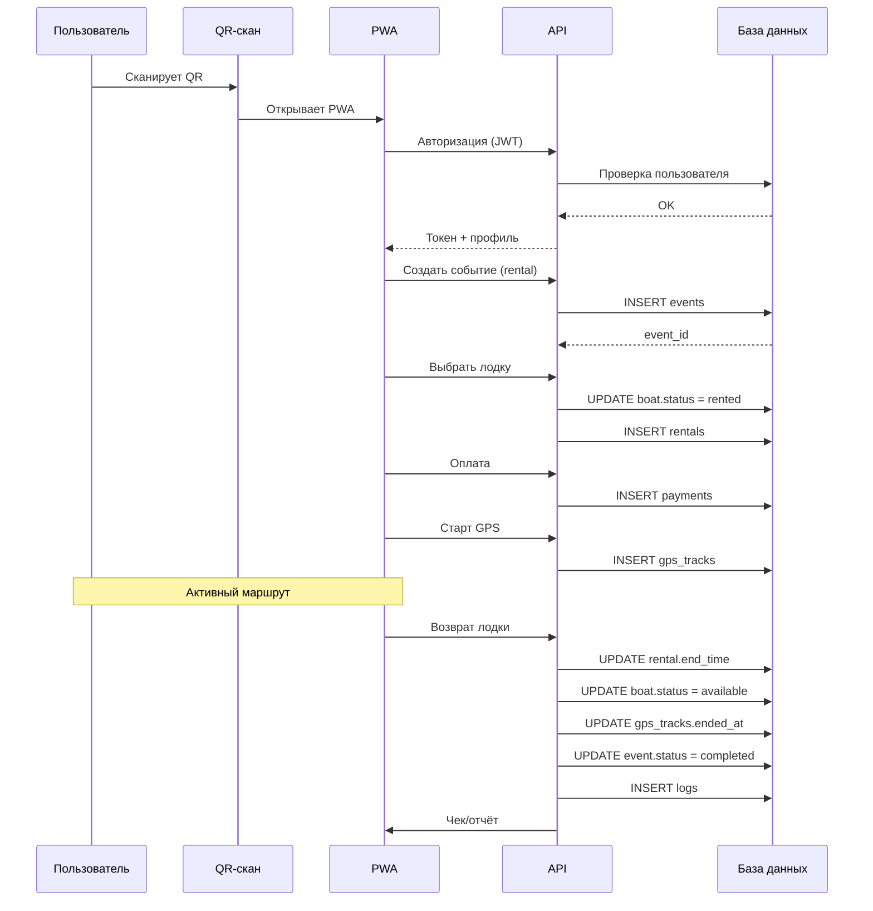
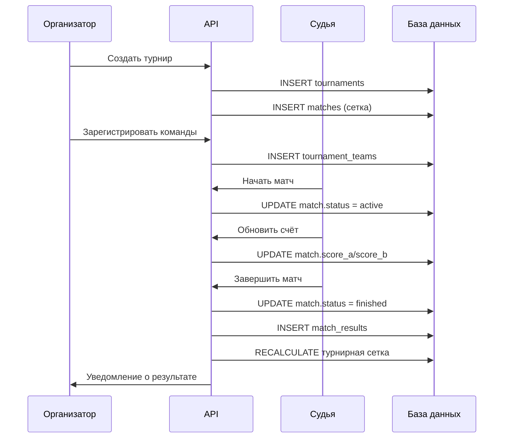

# EVENT FLOW DIAGRAM
## Версия 1.0 — Концептуальная

## 0. ГЛАВНЫЙ ПРИНЦИП

```
Система является EVENT-DRIVEN PLATFORM:
  любое действие → создаёт событие → запускает процессы → меняет данные
```

## 1. ГЛОБАЛЬНЫЙ FLOW

```
ПОЛЬЗОВАТЕЛЬ
    │
    ▼
QR / PWA (вход)
    │
    ▼
СОЗДАНИЕ СОБЫТИЯ
    │
    ▼
ПРОВЕДЕНИЕ АКТИВНОСТИ (ядро)
    │
    ▼
СБОР ДАННЫХ (GPS, журнал, результат)
    │
    ▼
ЗАВЕРШЕНИЕ СОБЫТИЯ
    │
    ▼
ОТЧЁТ / АНАЛИТИКА / ИСТОРИЯ
```

## 2. FLOW: АРЕНДА ЛОДКИ



## 3. FLOW: МАРШРУТ / ТРЕНИРОВКА

```
1. TRAINING_EVENT_CREATED
2. PARTICIPANTS_JOINED
3. SAFETY_CHECK_COMPLETED
4. ROUTE_STARTED
5. GPS_TRACKING_ACTIVE
6. CHECKPOINT_PASSED (для каждой точки)
7. ROUTE_COMPLETED
8. PERFORMANCE_RECORDED
9. TRAINING_CLOSED
```

**Особенности:** групповые GPS, адаптивные маршруты, разные уровни нагрузки.

## 4. FLOW: SOS / ПОТЕРЯ СВЯЗИ

```
--- Потеря сигнала ---
1. GPS_SIGNAL_LOST
2. WARNING_CREATED
3. LAST_POSITION_SAVED (локально)
4. INSTRUCTOR_NOTIFIED (при восстановлении связи)
5. EMERGENCY_STATUS_ENABLED

--- SOS от пользователя ---
1. SOS_BUTTON_PRESSED (даже офлайн)
2. EMERGENCY_EVENT_CREATED (локально)
3. GPS_POSITION_SAVED (последняя известная)
4. RESPONSIBLE_PERSON_NOTIFIED (при связи)
5. RESCUE_FLOW_STARTED
```

## 5. FLOW: МАТЧ КАНУПОЛО



## 6. FLOW: ИНКЛЮЗИВНАЯ ПРОГРАММА

```
1. PARTICIPANT_PROFILE_CHECKED
   - проверка accessibility_profiles
   - проверка medical_restrictions
2. ACCESSIBILITY_RULES_APPLIED
   - выбор допустимых нагрузок
3. SAFE_ROUTE_SELECTED
   - adaptive_route_access
4. SUPPORT_PERSON_ASSIGNED
   - escort_assignments
5. ADAPTIVE_EVENT_STARTED
6. CONDITION_MONITORING (периодическая проверка)
7. EVENT_COMPLETED
8. SAFETY_REPORT_CREATED
```

## 7. FLOW: ПОДКЛЮЧЕНИЕ ФРАНШИЗЫ

```
1. FRANCHISE_CREATED
2. POINT_REGISTERED
3. ADMIN_ASSIGNED (пользователь с ролью franchise_admin)
4. EQUIPMENT_REGISTERED (импорт лодок и инвентаря)
5. ROUTES_ATTACHED (локальные маршруты)
6. QR_CODES_GENERATED (для лодок, точек)
7. POINT_ACTIVATED
```

## 8. СКВОЗНЫЕ СОБЫТИЯ

| Событие | Источник | Описание |
|---------|----------|----------|
| USER_AUTHORIZED | Любой вход | Пользователь авторизован |
| GPS_UPDATED | GPS-трекер | Новая точка трека |
| OFFLINE_MODE_ENABLED | Клиент | Потеря связи |
| SYNC_STARTED | Клиент | Начало синхронизации |
| SYNC_COMPLETED | Клиент | Синхронизация завершена |
| PAYMENT_FAILED | Платежный шлюз | Ошибка оплаты |
| EMERGENCY_CREATED | SOS / система | Экстренная ситуация |
| NOTIFICATION_SENT | Система | Уведомление отправлено |
| REPORT_GENERATED | Система | Сформирован отчёт |

## 9. АРХИТЕКТУРНЫЕ ВЫВОДЫ

| Вывод | Описание |
|-------|----------|
| **Событие — ядро** | Все процессы создают, меняют и завершают события |
| **GPS — сквозной сервис** | Используется прокатом, маршрутами, безопасностью, спортом |
| **Offline-first обязателен** | Критично для воды, леса, массовых мероприятий |
| **Realtime не везде** | Нужен только: GPS, SOS, счёт матчей, уведомления |
| **Модули видны** | Core, Geo, Rental, Sport, Safety, Franchise |
